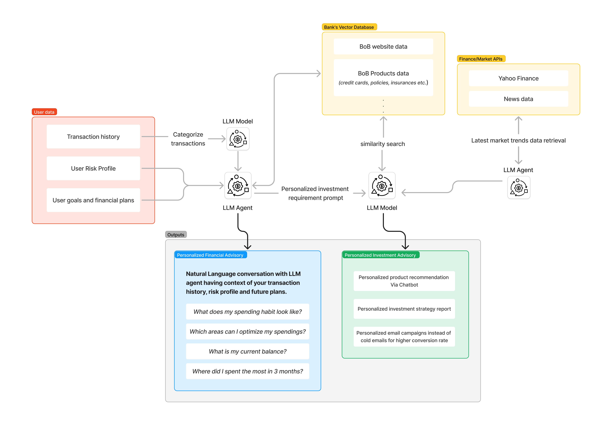

# Leveraging GenAI in Financial & Investment Advisory

GenAI can be leveraged in Financial and Investment Advisory tasks to provide comprehensive and personalized services, like:
- Categorize user's transaction (e.g., Investments, Bills, Entertainmet, Fuel etc.)
- Analyze user's financial data to uncover spending habits and patterns
- Interpret market trends to provide timely insights
- Personalized product recommendation 
- Tailored investment strategies based on:
    - User's risk profile
    - Spending patterns
    - Personal goals
    - Current market trends

This git repo demonstrates a high-level implementation of these use cases, showcasing the potential of GenAI in enhancing financial and investment advisory services.

### Architecture

### Workflow

